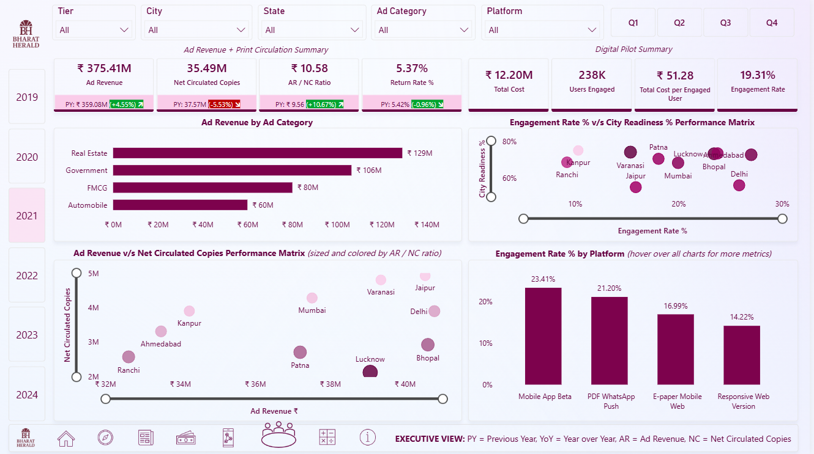

  # 📰 Welcome to the Bharat Herald Story

  This repository captures the journey of analyzing Bharat Herald’s data and building a roadmap for its digital future.  

  ---

  ## 🔗 Quick Links
  - 📊 [Live Power BI Dashboard](https://app.powerbi.com/view?r=eyJrIjoiYmMzZTY3NTItMmUzMi00MjlkLWE0YTktYThjZmU2MDZjN2Y4IiwidCI6ImM2ZTU0OWIzLTVmNDUtNDAzMi1hYWU5LWQ0MjQ0ZGM1YjJjNCJ9)  
  - 🎥 [Video Presentation](https://youtu.be/XXXXXXX)  
  - 💼 [LinkedIn Post](https://www.linkedin.com/posts/fake-link)  
  - 📄 [Project Reports (PDFs)](PDFs%20from%20Codebasics/)  
  - 🗂 [Datasets](Datasets/)  
  - 📝 [SQL Queries](SQL/Ad-hoc%20requests.sql)  
  - 📸 [Screenshots](Screenshots/)  

  ---

  ## 📌 Project Overview
  Bharat Herald, a 70-year-old legacy newspaper, is facing an existential crisis in the post-COVID digital era.  
  Once printing over **1.2 million copies daily**, circulation dropped drastically between 2019–2024.  

  The company’s 2021 digital pilot failed due to poor mobile usability, advertiser confidence declined, bureaus shut down, and employees were laid off.

  This project analyzes Bharat Herald’s **2019–2024 operational and financial data** to uncover what went wrong and recommend a **phased digital transformation strategy**.  

  ---

  ## ❓ Problem Statement
  - **Goal:** Provide insights to guide a legacy newspaper’s survival in a digital-first world.  
  - **Mandate:** Quantify the decline, assess city readiness, and recommend recovery strategies.

  ---

  ## 📂 Repository Structure
      ```
      Bharat-Herald-Digital-Strategy/
      │── Competitor Analysis/        # Competitor research (ChatGPT PDF)
      │── Datasets/                   # Excel files + Jupyter Notebook + metadata.txt
      │── PDFs from Codebasics/       # 4 official challenge PDFs
      │── Screenshots/                # Power BI & SQL output screenshots
      │── SQL/                        # CSVs + final .sql script
      │── Logo/                       # Project logo
      │── .gitignore                  # Ignore rules
      │── README.md                   # This file
      ```

  ---

  ## 📊 Data Sources
  All datasets are cleaned and stored in `/Datasets/`:

  1. **fact_print_sales_cleaned** – edition, city, copies sold, returned, net circulation  
  2. **fact_digital_pilot_cleaned** – platform, costs, reach, downloads, engagement, city_id  
  3. **fact_city_readiness_cleaned** – literacy, smartphone, internet penetration, year, quarter  
  4. **fact_ad_revenue_cleaned** – edition, ad category, revenue by quarter  
  5. **dim_city_cleaned** – city, state, tier  
  6. **dim_ad_category_cleaned** – ad category details  

  Each file is documented in `metadata.txt`.

  ---

  ## 🔍 Analysis Approach
  - **MySQL** → Answered structured ad-hoc business requests  
  - **Python (Jupyter Notebook)** → Cleaned and explored datasets, exported all to Excel  
  - **Power BI** → Built an interactive dashboard for insights  

  ---

  ## 📑 Business Requests (SQL)
  Key SQL deliverables included:
  1. Monthly Circulation Drop Check (Top declines)  
  2. Yearly Revenue Concentration by Category (>50% categories)  
  3. 2024 Print Efficiency Leaderboard  
  4. Internet Readiness Growth (2021)  
  5. Consistent Multi-Year Decline (2019–2024)  
  6. 2021 Outlier: High readiness, low engagement  

  ➡️ Full queries in [`SQL/Ad-hoc requests.sql`](SQL/Ad-hoc%20requests.sql)  

  ### 📸 Screenshots
  - **Business Request 1**  
      

  - **Business Request 2**  
      

  - **Business Request 3**  
      

  - **Business Request 4**  
      

  - **Business Request 5**  
      
      
      

  - **Business Request 6**  
      

  ---

  ## 📊 Power BI Dashboard
  An **interactive dashboard** integrates all insights.  

  🔗 [**View Live Dashboard Here**](https://app.powerbi.com/view?r=eyJrIjoiYmMzZTY3NTItMmUzMi00MjlkLWE0YTktYThjZmU2MDZjN2Y4IiwidCI6ImM2ZTU0OWIzLTVmNDUtNDAzMi1hYWU5LWQ0MjQ0ZGM1YjJjNCJ9)  

  ### Dashboard Previews
  - **Print Sales View**  
      

  - **Ad Revenue View**  
      

  - **Digital Pilot View**  
      

  - **Executive View**  
      

  ---

  ## 📚 Reports
  All official project files are stored in `/PDFs from Codebasics/`:
  - Media Problem Statement  
  - Primary & Secondary Analysis  
  - Ad-Hoc Requests  
  - How to Get Started Guide  

  Competitor analysis (ChatGPT deep dive) is stored in `/Competitor Analysis/`.

  ---

  ## 🛠 Tech Stack
  - **SQL (MySQL Workbench)** – Ad-hoc requests  
  - **Python (Pandas, Matplotlib, Jupyter)** – Exploratory analysis  
  - **Power BI** – Dashboards and storytelling  

  ---

  ## 🙌 Acknowledgement
  This project was developed as part of the **Codebasics Resume Project Challenge 17**.  
